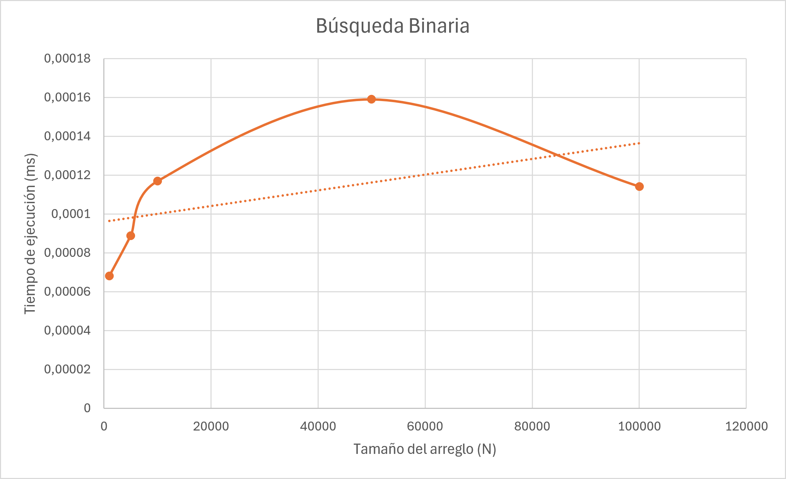
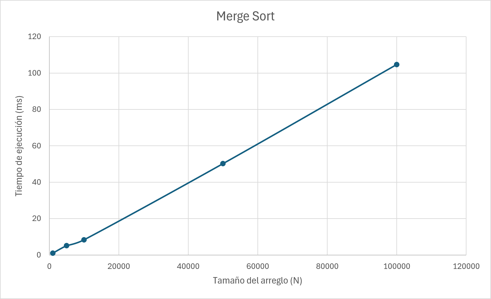

# Quiz #3 - Análisis de Algoritmos

## Integrantes

- Isaac Roberto Arce Madriz
- Jeremías Cubero Delgado

## Descripción

En este proyecto se realiza un análisis empírico del comportamiento de dos algoritmos: Búsqueda Binaria y Merge Sort.

El objetivo es ejecutar ambos algoritmos utilizando arreglos de diferentes tamaños, medir sus tiempos de ejecución y comparar los resultados experimentales con sus complejidades teóricas.

La complejidad teórica de cada algoritmo es:

- Búsqueda Binaria: O(log n)
- Merge Sort: O(n log n)

---

## Metodología

Para realizar las pruebas se generaron arreglos con números aleatorios de diferentes tamaños.

Los tamaños utilizados fueron:

- 1 000
- 5 000
- 10 000
- 50 000
- 100 000

Los tiempos fueron medidos utilizando la librería `chrono` de C++ y se muestran en milisegundos.

Para Merge Sort se creó una copia del arreglo original y se midió únicamente el tiempo que tarda el algoritmo en ordenar el arreglo.

Para la Búsqueda Binaria primero se ordenó el arreglo, ya que este algoritmo necesita trabajar con datos ordenados.

Debido a que una sola búsqueda binaria tarda muy poco tiempo, se realizaron 100 000 búsquedas y posteriormente se calculó el tiempo promedio de una búsqueda.

---

## Resultados obtenidos

| N | Búsqueda Binaria (ms) | Merge Sort (ms) | log2(N) | N log2(N) |
|---:|---:|---:|---:|---:|
| 1 000 | 0.000068105 | 1.0242 | 9.96578 | 9 965.78 |
| 5 000 | 0.000088926 | 5.1109 | 12.2877 | 61 438.6 |
| 10 000 | 0.000116998 | 8.3548 | 13.2877 | 132 877 |
| 50 000 | 0.000159125 | 50.2288 | 15.6096 | 780 482 |
| 100 000 | 0.000114172 | 104.71 | 16.6096 | 1 660 960 |

Las columnas `log2(N)` y `N log2(N)` representan el crecimiento teórico de los algoritmos y no corresponden a tiempos en milisegundos.

---

## Búsqueda Binaria

La Búsqueda Binaria tiene una complejidad teórica de:

O(log n)

Esto significa que la cantidad de operaciones aumenta lentamente aunque el tamaño del arreglo aumente considerablemente.

Los tiempos obtenidos fueron muy pequeños. Por ejemplo, para un arreglo de 1 000 elementos se obtuvo aproximadamente `0.000068105 ms`, mientras que para 100 000 elementos se obtuvo aproximadamente `0.000114172 ms`.

Se pueden presentar pequeñas variaciones entre las mediciones debido a que los tiempos de ejecución son extremadamente pequeños y pueden verse afectados por el sistema, el procesador y otros procesos que estén ejecutándose.

### Gráfica de Búsqueda Binaria



---

## Merge Sort

Merge Sort tiene una complejidad teórica de:

O(n log n)

A diferencia de la Búsqueda Binaria, Merge Sort debe trabajar con todos los elementos del arreglo para ordenarlos.

En las pruebas realizadas se puede observar un aumento considerable en el tiempo de ejecución conforme aumenta el tamaño del arreglo.

Por ejemplo:

- Para 1 000 elementos tardó aproximadamente 1.0242 ms.
- Para 10 000 elementos tardó aproximadamente 8.3548 ms.
- Para 50 000 elementos tardó aproximadamente 50.2288 ms.
- Para 100 000 elementos tardó aproximadamente 104.71 ms.

Este crecimiento es consistente con el comportamiento esperado de un algoritmo O(n log n).

### Gráfica de Merge Sort



---

## Comparación con el análisis teórico

Para comparar los resultados experimentales se calcularon también los valores teóricos de `log2(N)` y `N log2(N)`.

En el caso de la Búsqueda Binaria, el valor de `log2(N)` aumenta lentamente:

| N | log2(N) |
|---:|---:|
| 1 000 | 9.96578 |
| 5 000 | 12.2877 |
| 10 000 | 13.2877 |
| 50 000 | 15.6096 |
| 100 000 | 16.6096 |

Esto muestra por qué la Búsqueda Binaria sigue siendo rápida incluso cuando aumenta considerablemente la cantidad de elementos.

En el caso de Merge Sort, el valor de `N log2(N)` aumenta mucho más rápidamente:

| N | N log2(N) |
|---:|---:|
| 1 000 | 9 965.78 |
| 5 000 | 61 438.6 |
| 10 000 | 132 877 |
| 50 000 | 780 482 |
| 100 000 | 1 660 960 |

Los valores teóricos no representan milisegundos. Su función es mostrar la forma en la que debería crecer cada algoritmo al aumentar el tamaño de la entrada.

---

## Conclusión

Los resultados obtenidos permiten observar la diferencia entre el comportamiento de la Búsqueda Binaria y Merge Sort.

La Búsqueda Binaria mantiene tiempos de ejecución extremadamente pequeños incluso cuando aumenta el tamaño del arreglo. Esto coincide con su comportamiento teórico O(log n), donde el crecimiento es lento.

Por otro lado, Merge Sort presenta un aumento más notable en sus tiempos de ejecución a medida que aumenta la cantidad de elementos. Los resultados obtenidos presentan un comportamiento consistente con su complejidad teórica O(n log n).

De esta manera, el análisis empírico permite observar cómo las complejidades teóricas de ambos algoritmos se reflejan en su comportamiento durante ejecuciones reales.

---

## Estructura del proyecto

```text
Quiz3-Analisis-Algoritmos/
│
├── main.cpp
├── BusquedaBinaria.cpp
├── MergeSort.cpp
├── README.md
│
└── imagenes/
    ├── busqueda_binaria.png
    └── merge_sort.png